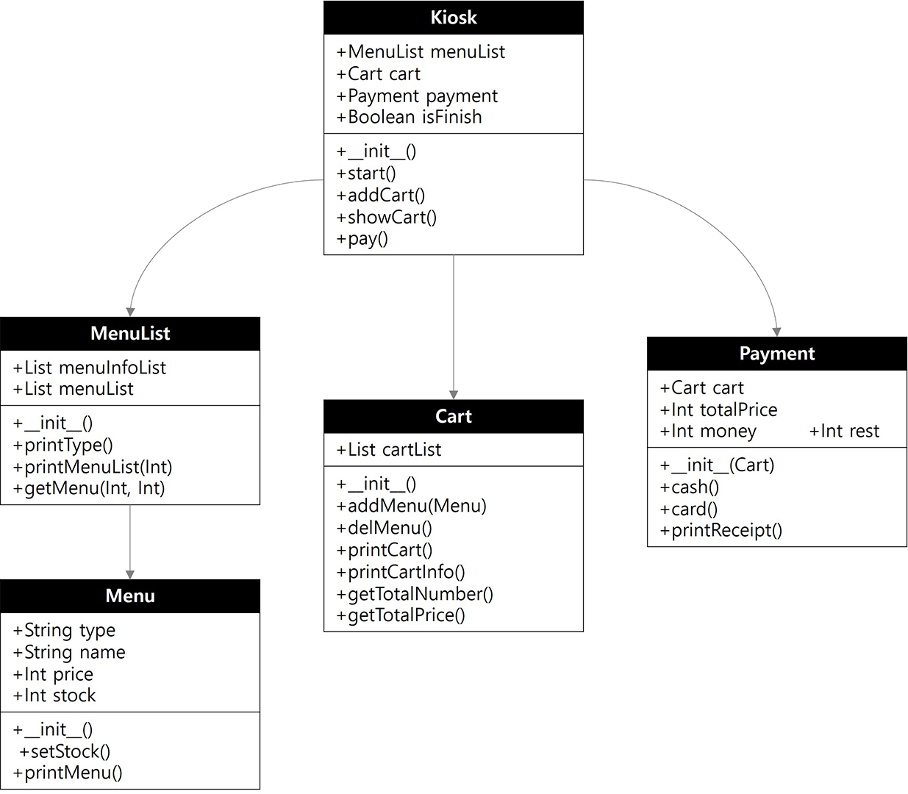

## Project Description

개발 언어 : Kotlin
과정 : [심화 과정] 안드로이드앱 과정  
주차 : 1주차  
과제 : 카페의 Kiosk 소프트웨어 개발  
조건 : 기초 과정인 Python으로 구현했던 내용을 Kotlin으로 변경하여, Kotlin과 Class Diragram에 대해 복습하는 과제  

## Method Description

1. 생성자 : 해당 class의 생성자 함수
2. 양식 함수 : 입력을 받아 특정 로직을 처리하는 함수
3. 출력 함수 : 출력만을 하는 함수
4. 반환 함수 : 데이터를 반환하는 함수

## Class Diagram

